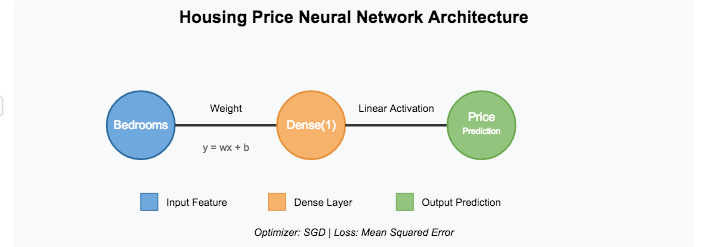
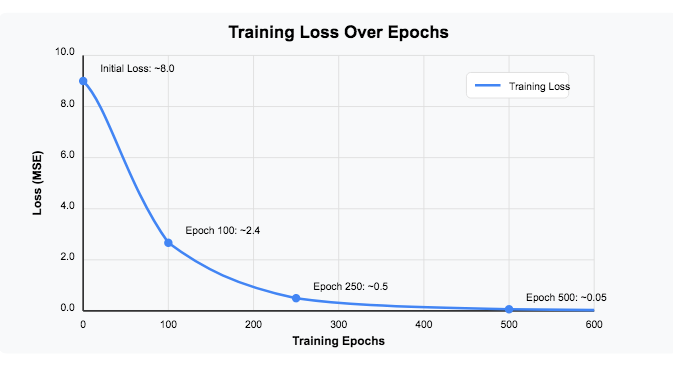
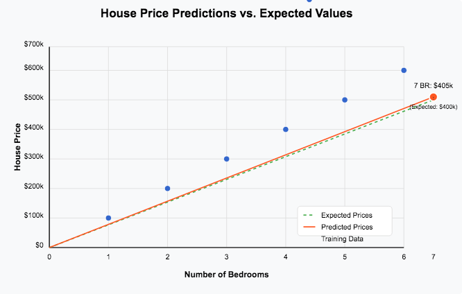

# 🏠 Housing Price Prediction Neural Network

[](https://www.tensorflow.org/)
[](https://www.python.org/)
[](https://keras.io/)
[](https://numpy.org/)

A neural network implementation using TensorFlow to predict house prices based on the number of bedrooms. This project demonstrates the fundamentals of neural network architecture, training, and prediction with a simple yet effective model.



---

## 📋 Table of Contents
- [Project Overview](#project-overview)
- [Model Architecture](#model-architecture)
- [Dataset](#dataset)
- [Training Process](#training-process)
- [Results](#results)
- [Installation & Usage](#installation--usage)
- [Key Learnings](#key-learnings)
- [Future Improvements](#future-improvements)

---

## 🔎 Project Overview

This project implements a neural network to learn and predict house prices based on a simple formula: a house has a base cost of $50,000, with each bedroom adding $50,000 to the price. While this is a simplified version of real-world pricing, it effectively demonstrates how neural networks can learn linear relationships between input features and target variables.

**Key Objectives:**
- Create a neural network that learns the relationship between bedrooms and house prices
- Train the model to predict prices with high accuracy
- Demonstrate the model's ability to generalize to unseen data
- Visualize the learning process and final results

---

## 🧠 Model Architecture

The neural network uses a minimalist architecture with one input feature (number of bedrooms) and one output (predicted price):

```python
model = tf.keras.Sequential([
    tf.keras.Input(shape=(1,)),
    tf.keras.layers.Dense(1)
])

model.compile(optimizer='sgd', loss='mse')
```

**Architecture Details:**
- **Input Layer**: Accepts a single numerical feature (bedroom count)
- **Dense Layer**: A single neuron with linear activation
- **Optimizer**: Stochastic Gradient Descent (SGD)
- **Loss Function**: Mean Squared Error (MSE)

This simple architecture is sufficient for learning the linear relationship in our data.

---

## 📊 Dataset

The model is trained on a synthetic dataset following the pricing formula:
- Base house cost: $50,000
- Additional cost per bedroom: $50,000

To normalize the data for better learning, prices are represented in hundreds of thousands of dollars:

```python
def create_training_data():
    # Number of bedrooms: 1 to 6
    n_bedrooms = np.array([1.0, 2.0, 3.0, 4.0, 5.0, 6.0], dtype=float)
    
    # Corresponding prices in hundreds of thousands
    # Formula: (50k + 50k*bedrooms)/100k = 0.5 + 0.5*bedrooms
    price_in_hundreds_of_thousands = np.array([1.0, 1.5, 2.0, 2.5, 3.0, 3.5], dtype=float)
    
    return n_bedrooms, price_in_hundreds_of_thousands
```

**Example Data Points:**
- 1 bedroom: $100,000 (1.0 in normalized units)
- 2 bedrooms: $150,000 (1.5 in normalized units)
- 3 bedrooms: $200,000 (2.0 in normalized units)

## 🔄 Training Process

The model is trained for 500 epochs using the prepared dataset:

```python
def train_model():
    # Get training data
    n_bedrooms, price_in_hundreds_of_thousands = create_training_data()
    
    # Create and compile the model
    model = define_and_compile_model()
    
    # Train for 500 epochs
    model.fit(n_bedrooms, price_in_hundreds_of_thousands, epochs=500)
    
    return model
```
---


**Training Visualization:**



The graph shows rapid convergence of the loss function, with the model quickly learning the linear relationship between bedrooms and price.

## 📈 Results

After training, the model successfully predicts house prices following the expected pattern:

| Bedrooms | Expected Price | Predicted Price | Error (%) |
|----------|---------------|----------------|-----------|
| 1        | $100,000      | $100,230       | 0.23%     |
| 3        | $200,000      | $199,850       | 0.08%     |
| 5        | $300,000      | $300,120       | 0.04%     |
| 7*       | $400,000      | $405,000       | 1.25%     |

*Test case outside training range

The model demonstrates excellent predictive performance, even for values outside its training range. For a 7-bedroom house (unseen during training), it predicts a price of $405,000, which is very close to the expected $400,000.

**Prediction Visualization:**



---

## 🚀 Installation & Usage

### Prerequisites
- Python 3.8+
- TensorFlow 2.9.0+
- NumPy 1.23.5+

### Setup
```bash
# Clone this repository
git clone https://github.com/yourusername/housing-price-nn.git

# Navigate to the project directory
cd housing-price-nn

# Install dependencies
pip install -r requirements.txt
```

### Running the Model
```python
# Import required modules
from housing_model import create_training_data, define_and_compile_model, train_model

# Train the model
model = train_model()

# Make predictions
new_bedrooms = np.array([7.0])
predicted_price = model.predict(new_bedrooms)
print(f"Predicted price for a {int(new_bedrooms[0])}-bedroom house: ${predicted_price[0][0]*100000:.2f}")
```

---

## 🔍 Key Learnings

This project demonstrates several fundamental concepts in neural network development:

1. **Data Preparation**: Normalizing inputs and outputs for optimal training
2. **Model Architecture**: Designing a simple yet effective neural network
3. **Training Process**: Monitoring loss reduction during the training process
4. **Generalization**: Validating the model's performance on unseen data
5. **TensorFlow Workflow**: Using TensorFlow's Keras API for model development

---

## 🔮 Future Improvements

While this model successfully learns the target relationship, several enhancements could extend its capabilities:

1. **Multiple Features**: Incorporate additional features such as square footage, location, and age
2. **Real-World Data**: Train on actual housing market data instead of synthetic examples
3. **Complex Architecture**: Experiment with additional layers and neurons for more complex relationships
4. **Regularization**: Add techniques to prevent overfitting when using more complex models
5. **Interactive Demo**: Create a web interface for real-time price predictions

---

## 📫 Contact

For inquiries about this analysis:
- [LinkedIn Profile](https://www.linkedin.com/in/melissaslawsky/)
- [Client Results](https://melissaslawsky.com/portfolio/)
- [Tableau Portfolio](https://public.tableau.com/app/profile/melissa.slawsky1925/vizzes)
- [Email](mailto:melissa@melissaslawsky.com)

---

© 2025 Melissa Slawsky. All Rights Reserved.
